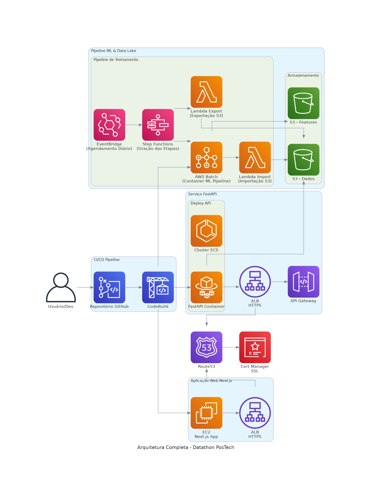
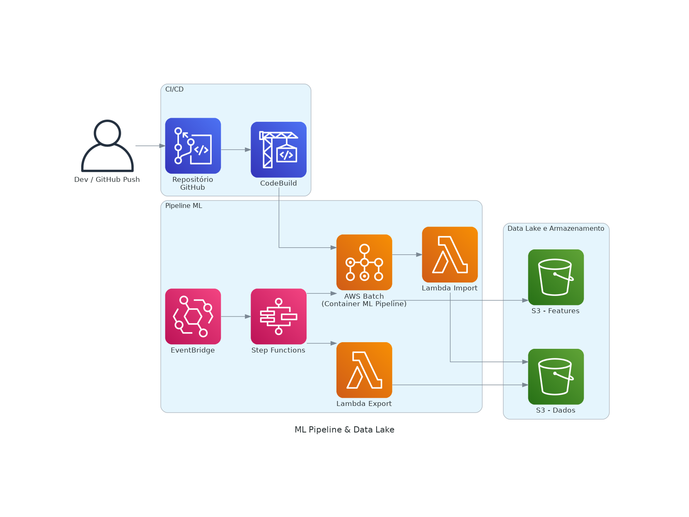
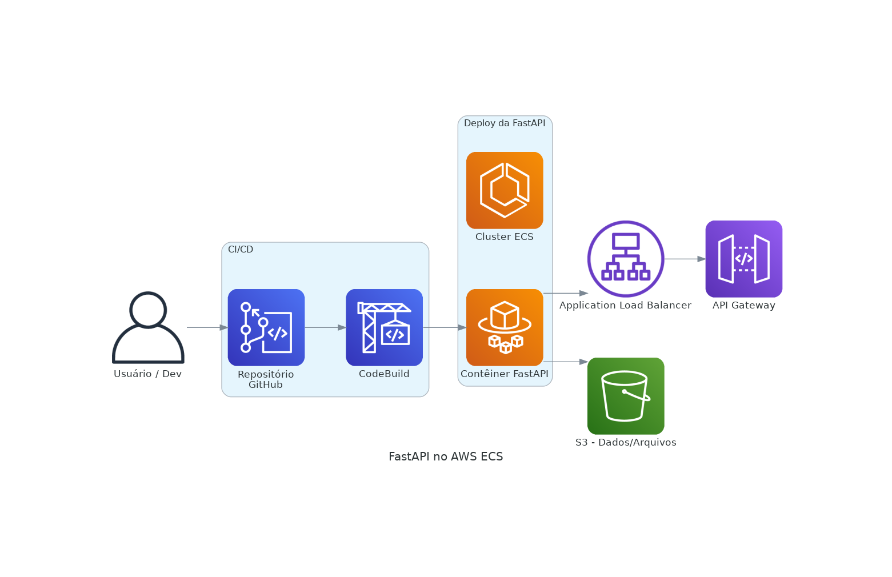
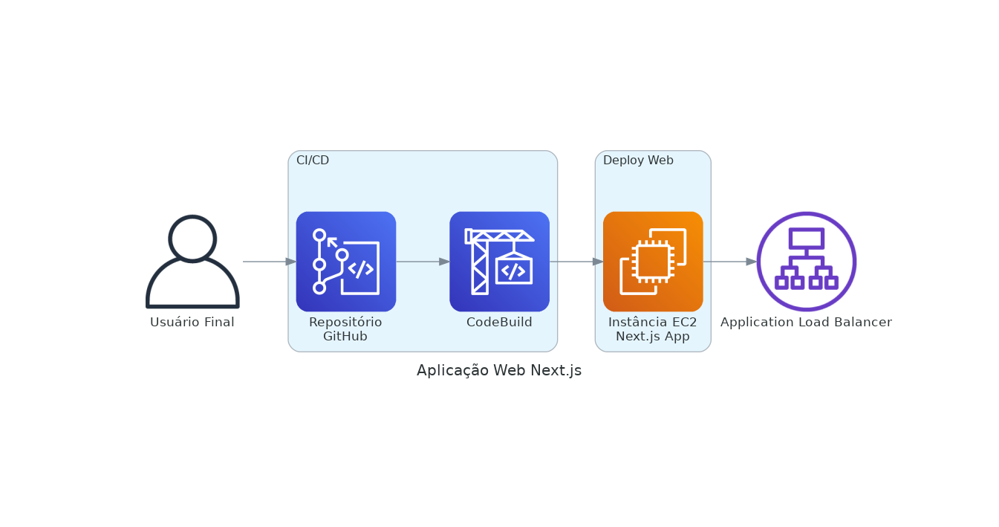

# Projeto Datathon PosTech Fiap

Projeto desenvolvido para acomodar três principais frentes sistêmicas na AWS Cloud, integrando os processos de dados, Machine Learning e aplicações web/serviços. Este repositório central concentra a documentação geral do projeto e oferece links para os repositórios modulares que abordam aspectos específicos de cada componente.

---

## Links para Repositórios

Confira os repositórios modulares relacionados às frentes do projeto:

- [Aplicação Web](https://app.grupo-ever-rmf.com/)
- [FastApi dominio](https://api.grupo-ever-rmf.com/docs)
- [AWS Infra Datathon](https://github.com/Renatmf5/aws-infra-datathon)
- [Aplicação de ML / Pipeline de Treinamento](https://github.com/Renatmf5/ml-lab-datathon)
- [Serviço FastAPI](https://github.com/Renatmf5/fastapi-service-datathon)
- [Aplicação Web Next.js](https://github.com/Renatmf5/webapp-datathon)

---

## Sumário

- [Visão Geral da Infraestrutura](#visão-geral-da-infraestrutura)
- [Pipeline de Dados e Machine Learning](#pipeline-de-dados-e-machine-learning)
- [Serviço FastAPI](#serviço-fastapi)
- [Aplicação Web em Next.js](#aplicação-web-em-nextjs)
- [Diagrama Geral da Infraestrutura](#diagrama-geral-da-infraestrutura)
- [Diagramas Específicos](#diagramas-específicos)
  - [Machine Learning & Data Lake](#machine-learning--data-lake)
  - [FastAPI no ECS](#fastapi-no-ecs)
  - [Aplicação Web Next.js](#aplicação-web-nextjs)
- [Links para Repositórios](#links-para-repositórios)
- [Considerações Finais](#considerações-finais)

---

## Visão Geral da Infraestrutura

Este projeto utiliza uma arquitetura robusta na AWS para suportar três frentes principais:

1. **Pipeline de Dados e Machine Learning**  
   - **Armazenamento e Data Lake:**  
     Buckets S3 são utilizados para armazenar dados brutos e features processadas. Essas camadas de armazenamento possuem versionamento e políticas de lifecycle para garantir a integridade dos dados ao longo do tempo.
   - **Execução do Pipeline de Treinamento:**  
     Um pipeline de treinamento, desenvolvido em Python, é executado em um container deployado via AWS Batch e disparado diariamente. A automação do fluxo é realizada pelo EventBridge, que agenda a execução diária e aciona o Step Functions para orquestrar as seguintes etapas:
     - **Lambda de Exportação:** Captura e envia dados necessários do Data Lake para o ambiente de treinamento.
     - **Treinamento via AWS Batch:** Executa o container responsável pela atualização dos modelos de Machine Learning.
     - **Lambda de Importação:** Atualiza os dados no Data Lake após o treinamento, garantindo que as novas features estejam disponíveis.
   - **Pipeline de CI/CD:**  
     Cada push no repositório aciona processos automatizados (utilizando CodeBuild e integração com GitHub) que reconstroem a imagem do container no ECR e realizam o deploy atualizado no AWS Batch. Esse fluxo intensivo de GET e PUT garante que os dados estejam sempre atualizados.

2. **Serviço FastAPI**  
   - **Deployment e Acesso:**  
     A API, implementada com FastAPI, é deployada em um container no ECS (Fargate), onde é exposta por um ALB que distribui o tráfego de entrada e possibilita integração com o API Gateway para futuras melhorias de segurança e gerenciamento de rotas.  
   - **Interação com o Data Lake:**  
     Além de fornecer os endpoints REST para a aplicação web, a FastAPI realiza operações de GET e PUT no S3 para acessar, processar e retornar dados essenciais para a plataforma.
   - **Pipeline de CI/CD:**  
     O código da API é integrado com um pipeline de CI/CD que, a partir de pushs no repositório, aciona CodeBuild e atualiza o deploy na ECS.

3. **Aplicação Web em Next.js**  
   - **Hospedagem e Consumo de Dados:**  
     A aplicação Next.js é hospedada em uma instância EC2 e consome os dados e os endpoints fornecidos pela FastAPI para compor uma interface web interativa e dinâmica.
   - **Exposição Segura:**  
     Através de um ALB configurado com certificado SSL (gerenciado por Route53 e Certificate Manager), os usuários acessam a aplicação via URL [https://app.grupo-ever-rmf.com](https://app.grupo-ever-rmf.com).
   - **Pipeline de CI/CD:**  
     Similarmente aos outros componentes, a aplicação web possui um pipeline que integra GitHub e CodeBuild para realizar deploys contínuos na instância EC2.

Além desses componentes, o **Route53** gerencia as URLs e o certificado SSL, garantindo a publicação segura e consistente tanto da API quanto da aplicação web.

---

## Pipeline de Dados e Machine Learning

- **Armazenamento:**  
  Dados brutos e features são organizados e versionados em buckets S3 que atuam como Data Lake.
  
- **Execução do Pipeline:**  
  - **EventBridge:** Agenda e dispara a execução diária do treinamento.
  - **Step Functions:** Orquestra as etapas do pipeline, acionando lambdas para exportação e importação de dados.
  - **AWS Batch:** Executa o container com o pipeline Python para treinamento dos modelos.
  - **CI/CD:** Integrações automáticas via CodeBuild e GitHub garantem que a nova imagem seja deployada automaticamente.

---

## Serviço FastAPI

- **Deployment:**  
  A FastAPI é deployada num container (Fargate, ECS), acessível via ALB e preparada para integrar um API Gateway, se necessário.
  
- **Funcionalidade:**  
  A API atua como backend, realizando operações de GET e PUT no S3 para fornecer os dados necessários à camada de apresentação (aplicação web).

---

## Aplicação Web em Next.js

- **Hospedagem:**  
  A aplicação Next.js roda em uma instância EC2 e consome os endpoints da FastAPI.
  
- **Exposição e Segurança:**  
  Um ALB com certificado SSL (configurado via Route53) assegura que a aplicação seja acessada de forma segura por meio de HTTPS.

---

## Diagrama Geral da Infraestrutura

A seguir, veja o diagrama que ilustra a arquitetura completa do projeto, integrando todos os componentes:

> **Legenda do Diagrama Geral:**  
> - **Data Pipeline & Machine Learning:** Inclui a automação diária do treinamento via AWS Batch, orquestrado pelo Step Functions e suportado por lambdas para exportação/importação de dados. Os buckets S3 servem como Data Lake para dados brutos e features.  
> - **FastAPI:** A API é deployada em um container Fargate dentro do ECS, gerenciada por um ALB e potencialmente integrada a um API Gateway.  
> - **Aplicação Next.js:** O frontend é hospedado em EC2, com tráfego dirigido por um ALB seguro.  
> - **Route53 e Gerenciamento de Certificados:** Responsáveis por garantir a publicação e segurança das URLs.

---

## Diagramas Específicos

### Machine Learning & Data Lake

> **Descrição e Legenda:**  
> Este diagrama detalha o fluxo do pipeline de Machine Learning:
> - **CI/CD:** O repositório integra CodeBuild, que atualiza a imagem no AWS Batch.
> - **Execução:** O EventBridge agenda, e o Step Functions orquestra as lambdas e o container de treinamento.
> - **Armazenamento:** Os buckets S3 atuam como Data Lake, armazenando dados brutos e features processadas.

---

### FastAPI no ECS

> **Descrição e Legenda:**  
> Este diagrama mostra a infraestrutura da API FastAPI:
> - **Deployment:** A API é executada num container Fargate dentro do ECS.
> - **Acesso:** Um ALB distribui o tráfego e o API Gateway propicia futuras integrações de segurança.
> - **CI/CD e Dados:** Repositório integrado via CodeBuild e operações com S3 para acesso aos dados.

---

### Aplicação Web Next.js

> **Descrição e Legenda:**  
> Este diagrama apresenta a aplicação web Next.js:
> - **Hospedagem:** Executada em uma instância EC2, com deploy contínuo via CodeBuild.
> - **Exposição:** Um ALB garante o acesso seguro via HTTPS, permitindo que os usuários acessem a interface interativa que consome os dados da FastAPI.

---

## Considerações Finais

Este repositório centraliza a visão completa do projeto Datathon PosTech Fiap, demonstrando a integração entre os fluxos de dados e treinamento de modelos, o serviço FastAPI e a aplicação web Next.js. O objetivo é garantir que, por meio da manipulação e atualização contínua dos dados no Data Lake, os modelos de Machine Learning sejam re-treinados diariamente, mantendo a plataforma sempre atualizada e segura.

Sinta-se à vontade para explorar os repositórios modulares e contribuir com melhorias por meio de issues e pull requests.